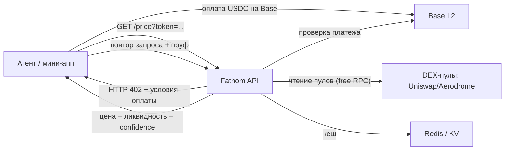

# Fathom — прайс-оракул для long-tail токенов Base

<aside>
🪙

**Идея в одну строку:** платный API, который отдаёт надёжную цену и ликвидность для тысяч мелких токенов Base, которые не покрывают крупные оракулы. Агенты и торговые мини-аппы платят за каждый вызов через x402 (USDC на Base). Себестоимость ≈ $0, спрос постоянный и повторяющийся.

</aside>

## Как назовём проект

**Выбранное название — Fathom** ✅ Раньше рабочим было BasePrice (слишком дженерик) — остановились на Fathom. Рассмотренные варианты:

| Название | Смысл |
| --- | --- |
| **Fathom** | «сажень» — мера глубины; и второе значение «постичь, разобраться». Глубина ликвидности + ясность цены в одном слове. |
| **Sonar** | эхолот прощупывает глубину пулов — метафора измерения ликвидности тонких токенов. |
| **Plinth** | «цоколь, основание» — игра на Base; фундамент цены для экосистемы. |
| **Beacon** | маяк — надёжный ориентир цены среди тысяч мелких токенов. |
| **Penny** | прямой намёк на penny / long-tail токены; дружелюбно и запоминается. |

Почему **Fathom**: короткое, легко произносится, двойной смысл «глубина + понимание» точно ложится на суть оракула — мы измеряем глубину ликвидности и даём ясность по цене.

## Проблема и белая зона

Крупные оракулы (Chainlink и т.п.) покрывают только топ-монеты. Но на Base — **тысячи long-tail токенов** (мемкоины, creator-coins через Zora, новые DeFi-токены), у которых нет надёжного источника цены.

При этом всем нужна цена и ликвидность этих токенов:

- торговым ботам и агентам, управляющим деньгами,
- мини-аппам с портфелями и P&L,
- дашбордам, кошелькам, аналитике.

**Почему это ещё не затоптано:** Base ушла в «trading-first» только в 2026, поток новых токенов резко вырос (мемкоины + creator-coins обгоняли Solana по дневным минтам), а x402 как способ монетизации появился буквально в начале 2026. Примитивы свежие → поле почти пустое.

## Что это (концепт)

HTTP-эндпоинт, например:

`GET /price?token=0xABC...&chain=base`

Возвращает структурированный JSON: текущую цену, TWAP, глубину ликвидности, основной пул/DEX, уверенность (confidence) и метку «надёжно / тонкая ликвидность / подозрительно».

Перед отдачей сервер возвращает `HTTP 402` с условиями оплаты, клиент платит USDC на Base и повторяет запрос — стандартный поток x402, без карт и подписок.

## Как это работает



Ключевая логика расчёта:

1. Находим пулы токена на основных DEX Base (Uniswap v3/v4, Aerodrome).
2. Считаем цену из резервов/тиков, берём **TWAP** за окно (защита от манипуляций).
3. Меряем глубину ликвидности и помечаем «тонкие» токены.
4. Кешируем результат на N секунд → почти нулевая себестоимость на повторных вызовах.

## Адреса контрактов DEX на Base

С этих контрактов сервис читает пулы и цены (всё через бесплатный RPC). Адреса проверены по официальным деплой-страницам и BaseScan:

| Протокол / контракт | Адрес | Зачем |
| --- | --- | --- |
| Uniswap v3 Factory | `0x33128a8fC17869897dcE68Ed026d694621f6FDfD` | находим v3-пулы токена по (token, fee) |
| Uniswap v4 PoolManager | `0x498581fF718922c3f8e6A244956af099B2652b2b` | singleton-пулы v4 (state через StateView / Quoter) |
| Uniswap v4 Universal Router | `0x6fF5693b99212Da76ad316178A184AB56D299b43` | роутинг и симуляция свопов v4 |
| Uniswap v2 Factory | `0x8909Dc15e40173Ff4699343b6eB8132c65e18eC6` | старые v2-пулы |
| Uniswap v2 Router02 | `0x4752ba5DBc23f44D87826276BF6Fd6b1C372aD24` | getAmountsOut / симуляция |
| Aerodrome Router | `0xcF77a3Ba9A5CA399B7c97c74d54e5b1Beb874E43` | главный DEX Base — swaps и quotes |
| Aerodrome FactoryRegistry | `0x5C3F18F06CC09CA1910767A34a20F771039E37C0` | находим pool-фабрики (v2 + Slipstream) |

Базовые токены-котировки (в них считаем цену) и платёжный токен:

| Токен | Адрес | Роль |
| --- | --- | --- |
| WETH | `0x4200000000000000000000000000000000000006` | основная котировка пар |
| USDC (native) | `0x833589fCD6eDb6E08f4c7C32D4f71b54bdA02913` | котировка + оплата x402 |
| AERO | `0x940181a94A35A4569E4529A3CDfB74e38FD98631` | частая котировка в пулах Aerodrome |

<aside>
⚠️

Адреса фабрик и роутеров стабильны, но перед продом сверяй их с официальной докой (Uniswap «Base deployments», [aerodrome.finance/security](http://aerodrome.finance/security)) — деплои иногда добавляют новые версии (например, Aerodrome Slipstream с концентрированной ликвидностью).

</aside>

## Confidence-скоринг

Это главная ценность сервиса — не просто цена, а **насколько ей можно верить**. Отдаём число `confidence` от 0 до 100 и текстовую метку. Идея заимствована у Pyth (цена ± σ) и Chainlink State Pricing для long-tail активов.

Из чего складывается (пример весов):

| Фактор | Что измеряем | Вес |
| --- | --- | --- |
| Глубина ликвидности | TVL основного пула + сколько $ двигает цену на 1% (slippage-депт) | 35% |
| Согласованность источников | расхождение цены между пулами и DEX (чем ближе — тем выше) | 20% |
| TWAP vs spot | отклонение spot от TWAP за окно (большой разрыв = манипуляция или волатильность) | 20% |
| Неопределённость σ/μ | ширина интервала цены к самой цене (Pyth-подход) | 15% |
| Зрелость рынка | возраст пула, объём за 24ч, число свопов | 10% |

Плюс жёсткие флаги, которые сразу роняют confidence и поднимают метку риска:

- ликвидность ниже порога → `thin_liquidity`,
- spot отклонился от TWAP больше X% → `volatile / possible_manipulation`,
- симуляция продажи реверзится (honeypot-паттерн) → `unsellable`.

Итоговая метка для клиента:

| confidence | Метка | Как использовать агенту |
| --- | --- | --- |
| 80–100 | 🟢 reliable | можно торговать и оценивать позицию |
| 50–79 | 🟡 thin / volatile | осторожно: уменьшить размер, брать нижнюю границу |
| 0–49 | 🔴 unreliable | не использовать для денег, только как инфо |

Практичный приём (как в Pyth): вместе с ценой отдаём `price_low = μ − σ` и `price_high = μ + σ`, чтобы агент сам выбирал консервативную границу под свой кейс (оценка залога vs оценка долга).

## Confidence: детальная формула

Мастер-формула — взвешенная сумма шести под-скоров, потом «потолки» от флагов:

```
confidence = round( 100 × (
      0.15 · S_liq      # припаркованная ликвидность
    + 0.20 · S_exec     # во что обходится продажа $10k
    + 0.20 · S_src      # согласованность источников
    + 0.20 · S_twap     # spot vs TWAP
    + 0.15 · S_sigma    # неопределённость sigma/mu
    + 0.10 · S_mat      # зрелость рынка
))
```

Раньше 0.35 нёс один только `S_liq`. Большая часть этого веса ушла в `S_exec`,
потому что «сколько я реально выручу на выходе» — это и есть тот вопрос, который
припаркованная ликвидность лишь изображала.

Каждый под-скор нормализован в диапазон 0..1:

| Под-скор | Как считаем | Параметры (старт) |
| --- | --- | --- |
| S_liq | `clamp( log10(liq / L_min) / log10(L_good / L_min), 0, 1 )` | L_min=$2k, L_good=$250k |
| S_exec | `1 - clamp( impact_bps / I_max, 0, 1 )` | I_max=1000 bps; 0, если продажа вообще не исполняется |
| S_src | `1 - clamp( max_dev / D_max, 0, 1 )` | D_max=5% (макс. расхождение цены между пулами) |
| S_twap | `1 - clamp( abs(spot-twap)/twap / T_max, 0, 1 )` | T_max=10% |
| S_sigma | `1 - clamp( (sigma/mu) / Sg_max, 0, 1 )` | Sg_max=8% |
| S_mat | `0.5*age_f + 0.5*vol_f` | age_f=`clamp(age_days/30,0,1)`, vol_f=`clamp(log10(vol24h/5k)/log10(500k/5k),0,1)` |

**Компонент со входом `null` не измерен, а не «в порядке».** Он исключается из
суммы, а его вес перераспределяется между измеренными. Доля номинальной модели,
за которой стоит реальное измерение, отдаётся в ответе как `measured_weight`.

После взвешенной суммы применяем жёсткие «потолки» (берём минимум) — они же выставляют флаги:

| Условие | Флаг | Эффект на confidence |
| --- | --- | --- |
| `liq < L_min` | `thin_liquidity` | min(c, 49) |
| продажу $10k нечем исполнить | `no_exit_liquidity` | min(c, 39) |
| `abs(spot-twap)/twap > 25%` | `possible_manipulation` | min(c, 39) |
| измерено меньше половины модели | `low_measurement_coverage` | min(c, 79) |
| только один пул | `single_pool` | min(c, 69) |
| данные устарели / RPC молчит | `stale` | min(c, 29) |
| симуляция продажи реверзится | `unsellable` | c = 0 (🔴) |

Потолок `low_measurement_coverage` существует потому, что перераспределение веса
делает арифметику корректной, но не делает доказательства достаточными: на одних
`S_src` и `S_sigma` токен считается в 95, стоя на 0.35 модели. Такой ответ больше
не имеет права назваться `reliable`.

Пример расчёта для токена из примера (PEPECOIN):

```
liq = $84,200      -> S_liq   = log10(42.1)/log10(125)  = 0.774
impact = 180 bps   -> S_exec  = 1 - 180/1000            = 0.820
max_dev = 1.5%     -> S_src   = 1 - 1.5/5               = 0.700
spot vs twap=0.45% -> S_twap  = 1 - 0.45/10             = 0.955
sigma/mu = 2.7%    -> S_sigma = 1 - 2.7/8               = 0.662
age, vol24h        -> S_mat   = не измеряем             = null

measured_weight = 0.90 (всё, кроме maturity)
веса нормируются на 0.90: 0.15/0.90, 0.20/0.90, ...

confidence = 100 * (0.15*0.774 + 0.20*0.820 + 0.20*0.700
                  + 0.20*0.955 + 0.15*0.662) / 0.90 ~= 79
liq > L_min, один пул? нет, coverage 0.90 > 0.5 -> потолков нет
-> confidence = 79 (🟡 thin/volatile)
```

<aside>
💡

Все пороги (L_min, D_max, T_max и т.д.) — конфигурируемые константы. Их надо подобрать на реальных данных Base (прогнать на выборке токенов и сверить с фактическим слиппажем).

</aside>

## UI и дизайн

Главный «интерфейс» сервиса — это **сам JSON-ответ API** (его «читают» агенты), а вокруг него — тонкая «человеческая» обёртка для разработчиков.

### Ответ API — основной интерфейс

Строгий и предсказуемый JSON. Всегда есть `confidence` и `flags`:

> **Пока не возвращаются:** `twap_5m`, `price_low`, `price_high`. Они убраны из живого
> ответа до тех пор, пока не будут действительно вычисляться — раньше они повторяли
> spot-цену с фиксированной полосой ±1%, то есть выдавали spot за TWAP и за измеренную
> неопределённость. Вернутся вместе с реальным TWAP и дисперсией по источникам.

```json
{
  "token": "0xABC...",
  "chain": "base",
  "symbol": "PEPECOIN",
  "price_usd": 0.00004217,
  "confidence": 73,
  "label": "thin",
  "liquidity_usd": 84200,
  "source_count": 2,
  "price_dispersion_bps": 118,
  "measured_weight": 0.7,
  "confidence_components": {
    "liquidity": { "score": 0.774, "weight": 0.15, "effective_weight": 0.214 },
    "execution_quality": { "score": 0.820, "weight": 0.20, "effective_weight": 0.286 },
    "source_agreement": { "score": 0.764, "weight": 0.20, "effective_weight": 0.286 },
    "twap_deviation": { "score": null, "weight": 0.20, "effective_weight": 0 },
    "volatility": { "score": 0.662, "weight": 0.15, "effective_weight": 0.214 },
    "maturity": { "score": null, "weight": 0.10, "effective_weight": 0 }
  },
  "main_pool": { "dex": "aerodrome", "address": "0x...", "fee": 0.003 },
  "flags": ["thin_liquidity", "twap_unavailable"],
  "updated_at": "2026-06-08T14:50:00Z"
}
```

Дизайн здесь = стабильный контракт: понятные поля, всегда есть оценка надёжности и флаги. Это и есть «красота» для разработчика.

### Лендинг + докаст (одна страница)

Минималистичная dev-страница в стиле Stripe / Vercel docs:

- Хедер: лого, одна строка-питч, кнопка «Try it».
- **Живой playground** на главной: поле «вставь адрес токена» → сразу показывает JSON + красивую карточку (цена, бейдж confidence, глубина пула).
- Блок «Quickstart» — 3 строки кода (`fetch` + x402).
- Таблица полей ответа.

### Карточка токена (визуальный компонент)

Для людей и для встраивания — компактная карточка, которую можно отдавать как embeddable badge/widget:

```
┌─────────────────────────────┐
│ 🐸 PEPECOIN        🟡 73/100 │
│ $0.00004217   ▲ 2.3% (24h)  │
│ Liquidity: $84.2K · Aerodrome│
│ ⚠ thin liquidity            │
└─────────────────────────────┘
```

### Developer dashboard

Для тех, кто берёт пакет/ключ:

- Баланс и расход (вызовы за сегодня/месяц, график).
- API-ключ, лимиты, история запросов.
- Раздел x402: подключённый кошелёк, потраченные USDC.

### Status page

Аптайм, задержка ответа и свежесть данных по DEX — внушает доверие платящим клиентам.

### Визуальный стиль

<aside>
🎨

**Dev-tool aesthetic:** тёмная тема по умолчанию, моноширинный шрифт для кода и адресов (JetBrains Mono / Geist Mono), акцент — синий Base `#0052FF`, семафор для confidence (🟢/🟡/🔴). Минимум иллюстраций, максимум воздуха, таблиц, код-блоков и копи-кнопок. Всё на free-tier: лендинг и playground — статика на Vercel / Cloudflare Pages.

</aside>

## Wireframe лендинга (поэкранно)

Одна длинная страница, блок за блоком сверху вниз:

```
+-------------------------------------------------+
| Fathom    Docs  Pricing  Status    [Get API key]|  <- 1. Nav
+-------------------------------------------------+
|   Цена и ликвидность для любого токена Base |
|   Платишь только за вызов · x402 · USDC          |  <- 2. Hero
|        [ Try it ]    [ Read docs ]              |
+-------------------------------------------------+
| token: 0x____________  [Get price]              |
|  +-----------------------+  { "price_usd":..., |  <- 3. Playground (живой)
|  | PEPE      73/100      |    "confidence":73 } |
|  +-----------------------+                      |
+-------------------------------------------------+
| Quickstart        ```js  fetchWithPay(...) ```  |  <- 4. Quickstart
+-------------------------------------------------+
| Поля ответа | price_usd | confidence | flags  |  <- 5. Таблица полей
+-------------------------------------------------+
| Как работает confidence   green/yellow/red + формула | <- 6. Explainer
+-------------------------------------------------+
| Pricing: $0.001-0.005/call · free tier          |  <- 7. Цены
+-------------------------------------------------+
| Для кого: боты · мини-аппы · кошельки · vaults |  <- 8. Use cases
+-------------------------------------------------+
| Footer: docs · github · x402 dir · status        |  <- 9. Footer
+-------------------------------------------------+
```

Коротко по блокам:

1. **Nav** — лого + ссылки (Docs / Pricing / Status) + яркая CTA «Get API key».
2. **Hero** — одна строка-питч + подзаголовок про x402, две кнопки (Try it / Docs).
3. **Playground** — главный «вау»: вставил адрес → мгновенно карточка + сырой JSON рядом. Первые вызовы бесплатны.
4. **Quickstart** — 3 строки кода с копи-кнопкой, вкладки JS / Python.
5. **Поля ответа** — таблица всех полей с типами и описанием.
6. **Confidence explainer** — семафор + коротко о формуле (доверие).
7. **Pricing** — цена за вызов + free tier + пакеты.
8. **Use cases** — карточки аудиторий (боты, мини-аппы, кошельки, vault-стратегии).
9. **Footer** — ссылки: docs, github, x402-directory, status.

## Полная дока API

### Эндпоинты

- `GET /v1/price` — цена одного токена.
- `GET /v1/prices` — батч (`?tokens=0x..,0x..`, до N адресов за вызов).
- `GET /v1/health` — статус сервиса (бесплатно).

### Параметры запроса (`/v1/price`)

| Параметр | Обяз. | По умолч. | Описание |
| --- | --- | --- | --- |
| `token` | да | — | адрес ERC-20 (0x...) |
| `chain` | нет | `base` | сеть |
| `quote` | нет | `usd` | `usd` / `eth` / `usdc` |
| `twap_window` | нет | `5m` | `1m` / `5m` / `1h` |
| `include` | нет | — | доп. поля: `pools`, `history` |

### Заголовки

- `X-PAYMENT` — payload оплаты x402 (на повторном запросе после 402).
- `Authorization: Bearer <key>` — альтернатива x402 для пакетных клиентов.

### Успешный ответ `200`

```json
{
  "token": "0xABC...",
  "chain": "base",
  "symbol": "PEPECOIN",
  "price_usd": 0.00004217,
  "confidence": 73,
  "label": "thin",
  "liquidity_usd": 84200,
  "main_pool": { "dex": "aerodrome", "address": "0x...", "fee": 0.003 },
  "pools": [
    { "dex": "aerodrome", "address": "0x...", "liquidity_usd": 84200, "price_usd": 0.00004217 },
    { "dex": "uniswap_v3", "address": "0x...", "liquidity_usd": 12100, "price_usd": 0.00004250 }
  ],
  "flags": ["thin_liquidity"],
  "updated_at": "2026-06-08T14:50:00Z"
}
```

### Коды ошибок

| HTTP | code | Когда |
| --- | --- | --- |
| 400 | `invalid_request` | невалидный адрес или параметр |
| 402 | `payment_required` | нужна оплата x402 (в теле — условия) |
| 404 | `token_not_found` | нет пулов для токена на Base |
| 422 | `no_liquidity` | пулы есть, но цену не посчитать |
| 429 | `rate_limited` | превышен free-tier лимит |
| 500 | `internal_error` | внутренняя ошибка |
| 503 | `rpc_unavailable` | все RPC недоступны, повторить позже |

Формат тела ошибки:

```json
{ "error": { "code": "no_liquidity", "message": "No tradable liquidity for token", "token": "0xABC..." } }
```

### Пример: JavaScript (оплата через x402)

```jsx
import { wrapFetchWithPayment } from "x402-fetch"
import { createWalletClient, http } from "viem"
import { privateKeyToAccount } from "viem/accounts"
import { base } from "viem/chains"

const account = privateKeyToAccount(process.env.PRIVATE_KEY)
const wallet = createWalletClient({ account, chain: base, transport: http() })

// оборачиваем fetch: 402 обрабатывается автоматически (USDC на Base)
const pay = wrapFetchWithPayment(fetch, wallet)

const res = await pay(
  "https://api.fathom.xyz/v1/price?token=0xABC...&chain=base"
)
const data = await res.json()
console.log(data.price_usd, data.confidence, data.label) // 0.00004217 73 "thin"
```

### Пример: Python (x402 в два шага)

```python
import os, requests
from x402.clients import sign_payment   # хелпер из x402 sdk

URL = "https://api.fathom.xyz/v1/price"
params = {"token": "0xABC...", "chain": "base"}

r = requests.get(URL, params=params)
if r.status_code == 402:
    requirements = r.json()                      # условия оплаты
    payment = sign_payment(requirements, os.environ["PRIVATE_KEY"])
    r = requests.get(URL, params=params, headers={"X-PAYMENT": payment})

data = r.json()
print(data["price_usd"], data["confidence"], data["label"])
```

### Пример: Python (по API-ключу)

```python
import requests

r = requests.get(
    "https://api.fathom.xyz/v1/price",
    params={"token": "0xABC...", "chain": "base"},
    headers={"Authorization": "Bearer fathom_sk_live_..."},
)
print(r.json())
```

## Admin-эндпоинты и безопасность

Cache-эндпоинты — это **мутирующие admin-операции**, а не метерируемые риды. Их **нельзя** выставлять за x402 (оплата ≠ полномочия) и надо исключить из x402-middleware. Доступ — только через `Authorization: Bearer ADMIN_AUTH_TOKEN`.

| Эндпоинт | Метод авторизации | Эффект |
| --- | --- | --- |
| `GET /v1/price` | x402 (оплата за вызов) | публичный платный рид цены |
| `GET /v1/health` | none (public) | статус сервиса, без секретов |
| `POST /v1/cache/invalidate` | Bearer ADMIN_AUTH_TOKEN | инвалидирует кеш по конкретному токену |
| `POST /v1/cache/clear/pool` | Bearer ADMIN_AUTH_TOKEN | чистит кеш конкретного пула |
| `POST /v1/cache/clear` | Bearer ADMIN_AUTH_TOKEN (лучше не публиковать) | полный флаш кеша — самая опасная операция |

### Правила admin-доступа

- **Constant-time сравнение** токена (`timingSafeEqual` / WebCrypto) — иначе timing-атака на побайтовый подбор.
- **Токен — только из секретов** (Cloudflare Workers Secrets / env), ≥ 32 байт случайных, никогда в коде/репозитории.
- **Только HTTPS** + **ротация** (держать 2 валидных токена для бесшовной смены).
- **Rate-limit + логирование** именно admin-вызовов (кто / когда / что чистил).
- `POST /v1/cache/clear` (полный флаш) лучше **вообще не публиковать** как открытый HTTP-роут — оставить внутренней операцией (cron / CLI / приватный worker).
- **Усиление по желанию:** Cloudflare Access / mTLS / IP-allowlist перед admin-роутами; на неавторизованный admin-запрос возвращать `404` вместо `401` (не светить существование эндпоинтов).

<aside>
🔐

**Почему:** x402 подтверждает оплату, а не полномочия. Если cache-эндпоинты открыть за x402, любой за $0.001 USDC сможет положить кеш → cache stampede → все запросы идут мимо кеша на RPC → лимиты → `503` платящим клиентам. Это атака на себестоимость и возможность манипулировать ценой.

</aside>

## MVP по шагам

- [ ]  **Шаг 1.** Скрипт, который по адресу токена находит пулы на одном DEX (Aerodrome или Uniswap) через бесплатный RPC и считает цену.
- [ ]  **Шаг 2.** Обернуть в HTTP-эндпоинт (`/price`) на serverless (Cloudflare Workers / Vercel).
- [ ]  **Шаг 3.** Добавить TWAP, глубину ликвидности и поле `confidence`.
- [ ]  **Шаг 4.** Прикрутить кеш (KV/Redis) — отсекает себестоимость на повторных запросах.
- [ ]  **Шаг 5.** Подключить x402-обёртку: `402` → проверка оплаты → отдача.
- [ ]  **Шаг 6.** Опубликовать в существующих агентских каталогах / x402-directory, написать мини-доку.

## Технический стек (всё на free-tier)

| Слой | Инструмент | Стоимость |
| --- | --- | --- |
| Рантайм/хостинг | Cloudflare Workers или Vercel (free) | $0 |
| Ончейн-чтение | Публичный Base RPC + viem | $0 |
| Кеш | Cloudflare KV / Upstash Redis (free) | $0 |
| Платежи | x402 (USDC на Base) + фасилитатор Coinbase | $0 + газ покрывается потоком |
| Язык | TypeScript | $0 |

## Тестовая стратегия

Решение: **без форка.** Прайс-путь читает напрямую с **Base mainnet** (read-only), а x402 остаётся на **Base Sepolia**. Разделяем две сети по ответственности:

| Слой | Сеть | Как |
| --- | --- | --- |
| x402 / оплата | Base Sepolia | проверка платежа (verifier / facilitator на тестнете) |
| Чтение пулов и цена | Base mainnet | публичный RPC + viem, только `eth_call` (без газа и приватного ключа) |

### Детерминизм без форка — запинить блок

Чтобы тесты были стабильными на «живом» mainnet, читаем на **фиксированном номере блока** (`blockNumber` в viem / block tag в `eth_call`). Тот же блок → тот же ответ, фикстур не плывёт. Пин-блок обновляем осознанно при обновлении снапшота. В проде же `PIN_BLOCK` не задан → берём `latest`.

### Config (env)

```
PRICE_RPC_URL=https://mainnet.base.org   # публичный Base mainnet RPC (read-only)
PRICE_CHAIN_ID=8453                      # Base mainnet
PIN_BLOCK=<номер блока>                 # только для детерминированных тестов; в проде пусто (latest)
X402_NETWORK=base-sepolia                # оплата остаётся в тестнете
```

### Чтение на запиненном блоке (viem)

```jsx
import { createPublicClient, http } from "viem"
import { base } from "viem/chains"

const client = createPublicClient({
  chain: base,
  transport: http(process.env.PRICE_RPC_URL),
})

// детерминированное чтение: тот же блок -> тот же ответ
const slot0 = await client.readContract({
  address: POOL,
  abi: poolAbi,
  functionName: "slot0",
  blockNumber: PIN_BLOCK,   // в проде не передаём -> latest
})
```

### Канонические тестовые токены (mainnet)

| Токен | Адрес | Роль в тестах |
| --- | --- | --- |
| WETH | `0x4200000000000000000000000000000000000006` | базовая котировка, всегда ликвидно (🟢 reliable) |
| USDC (native) | `0x833589fCD6eDb6E08f4c7C32D4f71b54bdA02913` | котировка в USD |
| AERO | `0x940181a94A35A4569E4529A3CDfB74e38FD98631` | второй ликвидный кейс (🟢) |

Для проверки 🟡/🔴 веток (thin / volatile / без пула) возьми реальный long-tail токен Base и подтверди его пул через `getPool(token, WETH, fee)` на фабрике — на запиненном блоке его `liquidity_usd` тоже будет стабильным.

### Чек-лист live test path

- [ ]  `PRICE_RPC_URL` смотрит на Base mainnet, `X402_NETWORK = base-sepolia`.
- [ ]  `PIN_BLOCK` зафиксирован → ответы детерминированы в CI.
- [ ]  Прогон на 3 токенах: ликвидный (🟢), тонкий (🟡), скам/honeypot или без пула (🔴 / 404).
- [ ]  `price_low` / `price_high` и `confidence` считаются по реальным резервам.

<aside>
⚠️

Публичный RPC `mainnet.base.org` имеет лимиты — для CI и прода держи фоллбэк (несколько RPC) и кеш на запиненный блок, чтобы не ловить 429.

</aside>

## Как агенты тебя находят (дистрибуция)

- Публикация в **x402-directory** и существующих «app store для агентов» — там агенты ищут платные сервисы.
- Открытая мини-дока + пример вызова (агенты любят машиночитаемые спеки).
- Бесплатный лимит (первые N вызовов в день) как «пробник» для разработчиков.
- Пост в ленте Base App с живым демо.

### x402 Bazaar Discovery (Base Mainnet)
Fathom is fully discoverable through CDP x402 Bazaar metadata (`@x402/extensions`). Automated agents can dynamically query endpoints and discover the required parameters and prices.

- **Canonical test token:** AERO (`0x940181a94A35A4569E4529A3CDfB74e38FD98631`)
- **Paid endpoints:** 
  - `GET /v1/price` (Price: 0.001 USDC)
  - `GET /v1/prices` (Batch pricing up to 50 tokens, Price: 0.003 USDC)
  - `GET /v1/metadata` (Price: 0.001 USDC)
  - `GET /v1/metadatas` (Batch metadata up to 10 tokens, Price: 0.001 USDC)
- **Price Config:** Configurable via `X402_PRICE_USDC` and `X402_PRICE_BATCH_USDC`
- **Base mainnet network ID:** `eip155:8453`
- **Validation Commands:**
  - Check x402 discovery metadata: `npx vitest run tests/middleware/x402.test.ts`
  - Check CDP facilitator status: `npx tsx scripts/check_x402_cdp_facilitator_support.ts`

## Первые клиенты (кого таргетим)

Ключ к выручке — повторяющиеся машинные вызовы. Самые горячие первые клиенты:

- **Торговые боты и AI-агенты с кошельком** (на Coinbase AgentKit / CDP, x402) — им нужна цена long-tail токена перед каждой сделкой; платят охотно, потому что уже умеют платить ончейн.
- **Снайпер- и мемкоин-боты** — проверяют новый токен на цену, ликвидность и honeypot за секунды; очень высокая частота вызовов.
- **Мини-аппы в Base App / Farcaster** (портфели, P&L, трекеры) — показывают стоимость холдингов в мелких токенах, которых нет у больших оракулов.
- **Кошельки и дашборды** — оценка баланса по long-tail активам.
- **DeFi-протоколы и vault-стратегии на тонких токенах** — нужен манипуляционно-устойчивый прайс (TWAP + confidence) как референс.
- **Аналитика, скринеры и другие агенты-сервисы** — перепродают данные конечным пользователям.

Стратегия первого контакта: выложить сервис в x402-directory и агентских каталогах, дать бесплатный лимит и прийти с готовым примером вызова в тех-чаты ботов и mini-app билдеров.

## Ценообразование

- Старт: **$0.001–0.005 за вызов** (микроплатёж через x402).
- Бесплатный лимит для разработчиков (захват длинного хвоста).
- Позже — пакеты/подписка для тяжёлых потребителей (боты с высокой частотой).
- Премиум-поля (исторические данные, alerts) дороже базовой цены.

## Нулевая смета

<aside>
💸

Пока трафик в пределах free-tier — расходы ~$0. Единственная реальная статья позже: платный RPC/инфра при росте нагрузки, но к этому моменту сервис уже зарабатывает на вызовах. Старт укладывается в твой лимит «меньше $20/мес» с большим запасом.

</aside>

## Дорожная карта

1. **Неделя 1–2:** MVP — один DEX, один эндпоинт, цена работает.
2. **Неделя 3:** TWAP + ликвидность + confidence + кеш.
3. **Неделя 4:** x402-оплата, публикация, первые внешние вызовы.
4. **Дальше:** больше DEX, исторические данные, алерты, пакеты.

## Риски и как их закрыть

| Риск | Как закрываем |
| --- | --- |
| Манипуляция ценой тонких пулов | TWAP + метка «тонкая ликвидность» + confidence-скоринг |
| Лимиты публичного RPC | Агрессивный кеш + несколько бесплатных RPC с фолбэком |
| Coinbase/крупный игрок выпустит своё | Узкая ниша long-tail + лучшие confidence-метрики + ранний вход |
| Скам/honeypot токены | Флаги в ответе (нельзя продать, владелец контракта и т.п.) как доп. ценность |