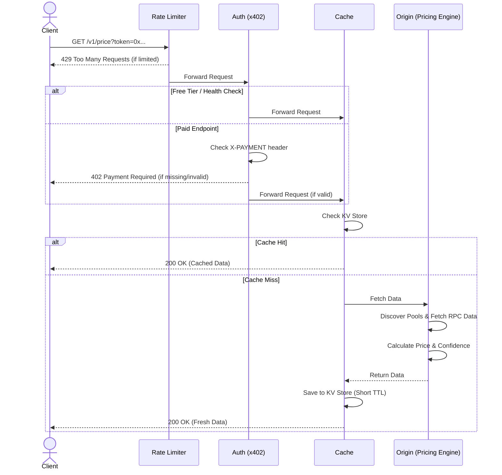

# Fathom Architecture

Fathom is a paid API for Base long-tail token prices, liquidity, TWAP and confidence scoring.

## API Boundary

Fathom provides a RESTful API for fetching token prices and liquidity data. It follows the x402 payment protocol for monetization.

### Endpoints

- `GET /v1/price`: Fetch price and confidence data for a single token.
- `GET /v1/prices`: Batch fetch prices for multiple tokens.
- `GET /v1/health`: Service health check (free, no payment required).

### Request Parameters (`/v1/price`)

| Parameter | Required | Default | Description |
| --- | --- | --- | --- |
| `token` | Yes | — | ERC-20 token contract address (0x...) |
| `chain` | No | `base` | Target blockchain network |
| `quote` | No | `usd` | Quote currency (`usd`, `eth`, `usdc`) |
| `twap_window` | No | `5m` | TWAP calculation window (`1m`, `5m`, `1h`) |
| `include` | No | — | Additional fields (`pools`, `history`) |

### Headers

- `X-PAYMENT`: x402 payment payload for paid requests.
- `Authorization`: Bearer token for enterprise/batch clients.

### Response Formats

#### Success Response (`200 OK`)

> **Not currently returned:** `twap_5m`, `price_low`, `price_high`. They are withheld from
> the live response until they are actually measured — they previously echoed the spot price
> back with a fixed ±1% band. They return with real TWAP and cross-source dispersion.

```json
{
  "token": "0xABC...",
  "chain": "base",
  "symbol": "PEPECOIN",
  "price_usd": 0.00004217,
  "confidence": 73,
  "label": "thin",
  "liquidity_usd": 84200,
  "source_count": 2,
  "price_dispersion_bps": 118,
  "confidence_components": {
    "liquidity": { "score": 0.774, "weight": 0.35, "effective_weight": 0.5 },
    "source_agreement": { "score": 0.764, "weight": 0.20, "effective_weight": 0.286 },
    "twap_deviation": { "score": null, "weight": 0.20, "effective_weight": 0 },
    "volatility": { "score": 0.662, "weight": 0.15, "effective_weight": 0.214 },
    "maturity": { "score": null, "weight": 0.10, "effective_weight": 0 }
  },
  "main_pool": { "dex": "aerodrome", "address": "0x...", "fee": 0.003 },
  "pools": [...],
  "flags": ["thin_liquidity", "twap_unavailable", "freshness_unchecked", "sellability_unchecked"],
  "updated_at": "2026-06-08T14:50:00Z"
}
```

#### Error Response

| HTTP Code | Error Code | Reason |
| --- | --- | --- |
| 400 | `invalid_request` | Invalid parameters or address format |
| 402 | `payment_required` | Payment via x402 required |
| 404 | `token_not_found` | No pools found for the token |
| 422 | `no_liquidity` | Pools exist but price cannot be calculated |
| 429 | `rate_limited` | Free tier or API limits exceeded |
| 500 | `internal_error` | Internal server error |
| 503 | `rpc_unavailable` | External RPC nodes are unresponsive |

### Request Lifecycle



## Core components

1. HTTP API
- Handles request routing and x402 payment verification.
- Enforces rate limits and API key validation.

2. DEX adapters
- Aerodrome (v2 + Slipstream)
- Uniswap (v2, v3, v4)
- Adapters follow a standard `DEXAdapter` interface:
  - `getPools(tokenAddress)`: Discover all relevant pools for a token.
  - `getRawData(poolAddress)`: Fetch reserves, ticks, or state for price/liquidity calculation.
- Discovery logic uses Factory and Registry contracts to locate pools programmatically.

3. Pricing engine
- Orchestrates price discovery by querying DEX adapters.
- **Confidence Scoring**: Produces a 0-100 score from a weighted model:

  | Component | Weight | Status |
  |---|---|---|
  | `liquidity` — depth of the deepest pool | 0.35 | measured |
  | `source_agreement` — max spread across independent pools | 0.20 | measured |
  | `twap_deviation` — spot vs TWAP | 0.20 | **not yet measured** |
  | `volatility` — liquidity-weighted sigma/mu across pools | 0.15 | measured |
  | `maturity` — pool age and 24h volume | 0.10 | **not yet measured** |

  **A component whose input is unavailable is excluded from the score and its
  weight is redistributed across the measured components.** It is never scored
  as if it were healthy. `confidence_components` in the response reports the
  per-component score and the effective weight actually applied, so a caller can
  see what the number is based on. `measured_weight` is the share of the nominal
  model that was live.

  An unmeasured component does not cap the score: the score already reflects
  only what was measured. The `twap_unavailable` flag is how a caller learns
  that no manipulation check stands behind a high number.

- **Source counting**: `source_count` counts pools that actually produced a
  price and clear a depth floor (the greater of $500 and 1% of the deepest
  pool), not pools merely discovered. Empty fee tiers therefore no longer
  suppress the `single_pool` ceiling, and a dust pool cannot fake a dispersion
  spike.
- **Executable depth**: `sell_quotes` answers what selling $1k / $5k / $10k of the
  token actually returns on the main pool, fees and slippage included, plus
  `depth_1pct_usd` / `depth_5pct_usd` for the notional that moves its marginal
  price. This is the number an agent holding a position needs; `liquidity_usd`
  only says how much is parked.

  Computed closed-form and exactly for constant-product pools (Uniswap V2,
  Aerodrome volatile) from reserves already fetched, so it costs no extra RPC:
  `dy = y*dx'/(x + dx')` for the fill, and `dx' = x*(1/sqrt(1-drop) - 1)` for depth.

  **Other curves are quoted, not approximated.** Concentrated liquidity
  (Uniswap V3) and Aerodrome stable pools (x3y+y3x) cannot be solved in closed
  form from the state we hold, so the DEX is asked directly:

  | Pool | Quoter | Address |
  |---|---|---|
  | Uniswap V3 | `QuoterV2.quoteExactInputSingle` | `0x3d4e44Eb1374240CE5F1B871ab261CD16335B76a` |
  | Aerodrome (both curves) | `Router.getAmountsOut` | `0xcF77a3Ba9A5CA399B7c97c74d54e5b1Beb874E43` |

  All sizes for a pool go out in one multicall, and only the main pool is
  quoted. The quoter simulates the swap for real, so tick crossing is accounted
  for - which matters most on exactly the thin tokens where a $10k exit leaves
  the active range.

  `depth_1pct_usd` / `depth_5pct_usd` stay null on the quoted path: a router
  cannot be cheaply inverted for "the notional that moves price 1%", and
  interpolating between quoted sizes would be an estimate dressed as a
  measurement. A size the quoter cannot fill is reported as null, not zero.
  `depth_unavailable` is raised only when nothing at all could be established.
- **TWAP** *(planned)*: historical ticks/reserves for a time-weighted average price.
- **Risk Flags**: Hard ceilings applied to the confidence score:
  - `thin_liquidity`: Liquidity below minimum threshold.
  - `possible_manipulation`: Large spot/TWAP deviation.
  - `single_pool`: Only one liquidity source found.
  - `stale`: Data is outdated or RPC is failing.
  - `unsellable`: Sell simulation reverts (honeypot check).
  - `hardcoded_numeraire`: Value is defined, not measured (USDC).
- **Transparency flags**: name checks that did *not* run, so their absence is
  never mistaken for a pass:
  - `twap_unavailable`, `freshness_unchecked`, `sellability_unchecked`.

3b. Batch execution (`/v1/prices`)
- **One engine per request.** Adapters, the viem RPC client and the orchestrator
  are constructed once for the whole batch. They used to be rebuilt per token,
  so a 50-token request created 200 RPC clients.
- **Shared WETH/USD anchor.** The engine memoizes the anchor *promise*, so
  tokens priced concurrently share a single in-flight lookup instead of racing.
- **Bounded parallelism.** Tokens are priced 8 at a time (`BATCH_CONCURRENCY`).
  Sequential processing paid every token's round-trip latency in series;
  unbounded parallelism would fan out 50 tokens' RPC calls at once and invite
  provider rate limiting. Results keep request order regardless of completion
  order.
- **Batched reads.** Every adapter issues one `multicall` per operation instead
  of one `eth_call` per probe: V3 pool discovery went from 8 sequential round
  trips per token to 1, Aerodrome from 4 to 1, and each `getRawData` from 3-4
  calls to 1. Besides latency, this keeps large batches clear of the Workers
  subrequest ceiling, and guarantees all reads for a pool share one block.
- **Decimals are cached per RPC client**, so a token's `decimals()` is read once
  per request. Failures are not cached, so a transient error stays retryable.

4. Cache
- **Storage**: Uses Cloudflare KV or Upstash Redis for fast lookups.
- **Strategy**:
  - Token metadata: Long TTL (hours).
  - Price/Confidence data: Short TTL (seconds) to ensure fresh data.
  - Reduces RPC costs and latency for repeated requests for the same token.

5. Payment layer (x402)
- Implements the x402 protocol:
  1. Client sends a request without payment.
  2. Server responds with `402 Payment Required` and payment parameters.
  3. Client pays USDC on Base network and signs the proof.
  4. Client retries request with `X-PAYMENT` header.
  5. Server verifies payment against Base L2 before returning price data.

## Production constraints

- No private keys in repo.
- No production secrets in code.
- All price responses must include confidence and flags.
- Thin liquidity must be clearly marked.

## Production Risks

- **Price Manipulation**: Low-liquidity pools can be manipulated to skew spot price. mitigated by TWAP and confidence scoring.
- **RPC Reliability**: Dependency on public/shared RPC nodes for on-chain data. Mitigated by caching and multiple RPC fallbacks.
- **Data Staleness**: Rapid price movements might not be captured if cache TTL is too high.

## Non-goals

- **Cross-chain support**: MVP is strictly focused on Base network.
- **Sub-second Latency**: Fathom is optimized for reliability and confidence, not high-frequency trading.
- **Order Execution**: Fathom is a read-only price oracle, it does not execute swaps.

## MVP Tech Stack Choice

The chosen runtime for the Fathom MVP is **Cloudflare Workers**.

### Tradeoffs: Cloudflare Workers vs. Vercel

When evaluating the MVP stack, we compared Cloudflare Workers against Vercel. Cloudflare Workers was selected due to its robust edge ecosystem and generous free tier, which aligns perfectly with Fathom's $0 overhead requirement.

Here are the specific tradeoffs considered:

- **viem**: Cloudflare Workers' edge runtime (V8 isolates) historically required special polyfills for Node.js standard libraries compared to Vercel's standard Node.js environments. However, `viem` has made significant improvements to its edge compatibility, making Cloudflare a viable and fast option for on-chain reads. Vercel provides an easier out-of-the-box experience for standard Node packages, but Cloudflare's performance benefits outweigh the minor configuration overhead.
- **cache**: Fathom relies heavily on caching to minimize RPC calls and guarantee low latency. Cloudflare KV provides a natively integrated, globally distributed, and generous free-tier cache. Vercel KV (powered by Upstash Redis) is an excellent alternative but has more restrictive free-tier limits (e.g., lower daily command limits), which could become a bottleneck as Fathom scales its API requests.
- **x402 integration**: Fathom's monetization relies on the x402 payment protocol, which involves intercepting requests to return a `402 Payment Required` response quickly. Cloudflare Workers offers exceptionally low-latency edge execution, ensuring that payment checks and proxying logic happen instantly. Vercel Edge functions provide similar capabilities, but Cloudflare’s infrastructure is explicitly optimized for this type of fast, edge-first middleware layer.
